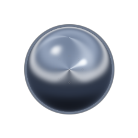

# liquidMetal

A blob of polished liquid metal that floats on top of your desktop. Grab it with the
mouse, fling it, and it coasts with inertia, stretching along its velocity and
wobbling when it settles. Everywhere except the blob itself, clicks pass straight
through to whatever is behind it.



Runs on **Linux** (X11/XWayland), **macOS** (Cocoa) and **Windows** (DWM). Any of
them can throw the blob to any other.

## Requirements

Almost everything below is needed to **build** it, which includes
[installing](#installing-it) it — `cargo install` compiles SDL2 from source rather
than downloading anything. Running an already-built binary needs far less, and that
is spelled out at the end.

**Rust 1.85 or newer.** The crate is edition 2024, which is what sets the floor; no
dependency asks for more than 1.71. Built and tested on 1.96.1.

**An OpenGL 3.3 core context.** The shader is `#version 330 core`. On the overlay
path NVIDIA answers with a 4.6 compatibility context instead, for reasons in
[Transparency](#transparency-the-part-that-is-genuinely-fiddly); the shader runs
unchanged either way.

### Linux

An **X11 server, or XWayland on `$DISPLAY`** — the overlay is an X11 client and
refuses to start on any other SDL video driver rather than silently misbehaving. The
compositor has to composite ARGB windows and honour `_NET_WM_STATE_ABOVE`; KWin
does, and is what this was developed against.

Building the bundled SDL2 needs **CMake, a C compiler, and the X11 development
headers**:

```sh
# Fedora / Nobara
sudo dnf install cmake gcc libX11-devel libXext-devel libXfixes-devel mesa-libGL-devel

# Debian / Ubuntu
sudo apt install cmake build-essential libx11-dev libxext-dev libxfixes-dev libgl-dev
```

The X11 headers are not optional and their absence is quiet: SDL's CMake simply
builds without an X11 backend, and the first thing you see is the program refusing to
start because SDL picked some other video driver. There is nothing to install for
X11 on the Rust side — `x11rb` is pure Rust and needs no C headers.

You do **not** need SDL2 itself, at build time or run time. It is compiled from the
`sdl2` crate's vendored sources and statically linked, which is the `bundled-sdl`
feature and is on by default. If you would rather link a system SDL2, install it and
build with `--no-default-features`.

*Versions this was built against: CMake 4.3.0, GCC 16.1.1, libX11 1.8.13, Mesa 26.1.4
on Nobara/Fedora 44, KDE Plasma on Wayland with XWayland.* CMake 4 removed
compatibility with the `cmake_minimum_required(VERSION 3.0)` the vendored SDL
declares; `.cargo/config.toml` sets `CMAKE_POLICY_VERSION_MINIMUM=3.5` so a plain
`cargo build` works anyway.

### macOS

```sh
xcode-select --install     # if you have never built anything on this machine
brew install cmake
```

Nothing else — the same bundled SDL2 covers the rest. See
[`doc/macos.md`](doc/macos.md), in particular the transparency section: on macOS 26
an overlay that is transparent takes four separate settings and a re-assert, and
every one of them reads back as correct while the screen is still black.

### To run an already-built binary

Less than you might expect, because the binary carries nearly everything with it.
It links only `libc`, `libm`, `libgcc_s` and the loader — there is no `libSDL2`
dependency, since SDL is statically linked in, and no data files, since the shader is
compiled into the executable.

What it needs on the machine it runs on:

- an **X server, or XWayland**, and a compositor as described above;
- **OpenGL 3.3**;
- six shared libraries, which SDL opens lazily at run time rather than linking:
  `libX11.so.6`, `libXext.so.6`, `libXfixes.so.3`, `libXrandr.so.2`,
  `libXcursor.so.1`, `libGL.so.1`. These are the ordinary runtime packages — *not*
  the `-devel` ones above — and any working desktop already has them.

No Rust, no CMake, no compiler, no headers. So a binary built on one machine runs on
another of the same architecture without any of the build requirements being
installed there.

### Optional

- **ImageMagick**, only to convert what `--capture` writes into something you can
  look at: `magick blob.pam blob.png`.
- **Nothing extra for `--net`.** It uses UDP multicast and TCP over the network you
  are already on. macOS will ask twice — once for the firewall, once for local
  network access on macOS 15 and later — and both have to be allowed or throws
  arrive nowhere.

## Running it

```sh
cargo run --release
```

There are aliases in `.cargo/config.toml` for the runs you make most often, mostly to
be rid of the `--` separator `cargo run` needs before a flag meant for the program
rather than for cargo. Extra arguments still append, so `cargo net --net-group
kitchen` does what it looks like.

| Alias | Runs |
| --- | --- |
| `cargo blob` | `cargo run --release --` |
| `cargo net` | the overlay, finding other machines |
| `cargo net-echo` | a headless peer: catch a blob and throw it back |
| `cargo net-serve` | the same, but put a blob into play to start with |
| `cargo check-mac` | type-check the macOS build from Linux |

The first build compiles SDL2 from the vendored sources and takes a minute or two;
after that it is cached. See [Requirements](#requirements) for what has to be
installed, which on Linux is CMake, a C compiler and the X11 development headers.

The overlay is a genuinely different animal on each platform;
[`doc/macos.md`](doc/macos.md) and [`doc/windows.md`](doc/windows.md) are where those
differences are written down.

| Flag | What it does |
| --- | --- |
| *(none)* | The desktop overlay. This is the product. |
| `--windowed` | An ordinary opaque window with a checkerboard behind the blob. For working on the renderer without fighting the compositor. |
| `--capture <path>` | Render a few frames, read the blob back out of the framebuffer, write it to `<path>` as a NetPBM PAM (RGBA, premultiplied), exit. The lever that makes the renderer checkable without looking at a screen. |
| `--selftest` | Step the physics headlessly through a scripted grab / fling / bounce, print PASS/FAIL per assertion, exit non-zero on failure. |
| `--net` | Find other machines on the network and turn the screen edges that lead to one into doors. See [Throwing it to another machine](#throwing-it-to-another-machine). |
| `--net-echo` / `--net-serve` | A headless peer that catches a blob and throws it back. The stand-in for a second computer. |
| `--span-displays` | macOS only: one window across every display instead of one. Needs "Displays have separate Spaces" turned off — see [`doc/macos.md`](doc/macos.md). |

```sh
cargo test                              # 51 unit tests
cargo run --release -- --selftest       # 8 scripted-simulation assertions
```

## Installing it

To have it on your `PATH` rather than running it out of the source tree:

```sh
cargo install --path .
liquid-metal --net          # from anywhere
```

That builds release and drops `liquid-metal` in `~/.cargo/bin`. The binary is
self-contained — the shader is compiled into it and SDL2 is statically linked, so
there is nothing beside it to install and nothing it reads from the source
directory at run time. `cargo uninstall liquid-metal` removes it.

Run it from inside the checkout, as above. Installing straight from the repository
URL works too, but needs one variable set by hand:

```sh
CMAKE_POLICY_VERSION_MINIMUM=3.5 cargo install --git https://github.com/VictorGug/liquidMetal
```

That variable normally comes from `.cargo/config.toml` in the checkout — the vendored
SDL declares `cmake_minimum_required(VERSION 3.0)` and CMake 4 refuses it — and cargo
reads its config relative to the directory you are standing in, not the sources it
cloned. Hence the export when there is no checkout to stand in.

The first install compiles SDL2 from source and takes a minute or two; after that it
is cached.

## Controls

| Input | Action |
| --- | --- |
| Left-drag | Move the blob; release to fling it |
| Double-click | Reset to the centre of the screen |
| Middle-click on the blob | Quit |
| `Esc` | Quit, when the window has keyboard focus |
| `Ctrl+C` | Quit, from the terminal (SDL turns `SIGINT` into `SDL_QUIT`) |

Because the click-through region *is* the hit test, the app only ever sees a click
that lands on the blob. Everything else goes to the apps underneath, so middle-click
and `Esc` only reach us when we are genuinely the target.

## Throwing it to another machine

Run it with `--net` on two machines — `cargo net` is a shorthand for exactly that —
and the edges of your screen stop being walls.
Fling the blob off the right-hand side and it leaves — sliding off the edge, still
stretched from the throw — and arrives on the other screen a moment later, entering
from the left at the same height, still deformed, wobbling as it settles. Throw it
back and you have a game of catch.

```sh
cargo net                              # on both machines
```

The two ends do not have to be the same kind of machine. A Linux box and a Mac play
catch with each other; the wire format is defined in absolute terms precisely so
that they can.

Nothing is configured. Each machine broadcasts a beacon once a second and listens
for others; with exactly one peer, **every** edge leads to it, which is the case
worth optimising for. With several, or if you want only one edge to be a door, pin
them:

```sh
cargo run --release -- --peer right=othermachine:41521
```

| Flag | What it does |
| --- | --- |
| `--net` | Turn it on. Off by default — it opens a socket, and see the warning below. |
| `--peer [EDGE=]HOST:PORT` | Name a peer explicitly, optionally pinned to one edge. Implies `--net`. Repeatable. |
| `--net-group NAME` | Only talk to peers announcing this group, so two pairs can play independently. |
| `--net-name NAME` | How this machine introduces itself. Defaults to the hostname. |
| `--no-discovery` | No beacons at all; `--peer` only. |
| `--net-capacity N` | How many blobs this screen will hold before refusing throws. 1–4. |

### The blob is never in two places, and never in no place

A throw is a **transfer with a receipt**, not a fire-and-forget message. The moment
the blob crosses the line it would have bounced off, its state goes to the peer over
TCP — but it stays here, still simulated, still drawn sliding off the edge, until
the peer says it has it. Only then is the local copy deleted.

Everything else ends with the blob still yours. Refused because the other screen is
full, connection failed, peer vanished mid-throw, no answer inside 900 ms — all of
them bounce it back onto your screen, coasting back in under its own power rather
than being snapped to the wall. **The wall is the fallback.** `--net` cannot lose
your blob; the worst it can do is not take it.

That is also why the screen holds more than one blob. If a full screen simply
refused every throw, two people who each had a blob could never pass one to each
other. Instead a screen holds up to four, and blobs that touch are drawn as one
metaball field — so two of them meeting flow together into a single pool of mercury
rather than overlapping like decals, which is the whole reason the blob is made of
what it is made of.

### Trying it without a second computer

`--net-echo` is a peer with no screen: it joins the network, catches whatever is
thrown at it, and throws it straight back. `--net-serve` does the same but puts a
blob into play to start with.

```sh
cargo net-serve &                       # invents a blob and throws it at you
cargo net                               # catch it
```

That is a complete round trip through real sockets — discovery, throw, catch,
receipt, return — with one machine and no mouse. Two `--net-echo` instances plus one
`--net-serve` will play catch with each other indefinitely.

It earns its place for a better reason than convenience, though. The thing at the
other end of a real throw is expected to be a *different program on a different
operating system*, so testing this binary against itself would happily pass a broken
assumption back and forth and never notice. `--net-echo` has no physics, no renderer
and no window — only the protocol — so anything it can catch and return is defined
by `wire.rs` rather than by shared code.

### The wire format

`src/wire.rs` is the specification, not an implementation detail, and it is written
to be implementable from scratch on the other end. The short version:

- Frames are `magic "LQMB" | version u16 | kind u16 | length u32 | payload`.
  **All integers little-endian, all floats IEEE-754 binary32 little-endian.** A frame
  whose magic or version does not match is dropped without a reply.
- **UDP multicast** on `239.255.71.11:47811` carries the once-a-second presence
  beacon. **TCP**, on an ephemeral port announced in that beacon, carries the throw.
- Four messages: `Beacon`, `Throw`, `Ack`, `Nack`.

The part worth getting right is the units, because the two screens are different
sizes. Nothing on the wire is in pixels:

| Quantity | Unit |
| --- | --- |
| Position along the edge | a fraction, `0..=1` |
| Velocity | **screen heights per second**, with *both* components scaled by the receiver's screen height — scaling uniformly rather than x-by-width and y-by-height is what preserves the angle of the throw between screens of different aspect ratios |
| Satellite offsets and velocities | units of the sender's satellite orbit radius |

What crosses the wire is the gesture, not the geometry. Each end keeps its own blob
size, and a peer that models its blob with a different number of satellites — or
none — still gets a throw that lands; it just arrives round instead of wobbling.
`wire_layout_is_pinned` fails if any offset or field width moves, which is the signal
to bump `PROTOCOL_VERSION`.

### This is not authenticated

Anyone on your network who speaks the protocol can throw a blob at you or read your
beacon. There is no key, no handshake and no encryption. That is why none of it runs
unless you pass `--net`, and `--net-group` is a name rather than a password — it
scopes discovery so two pairs of machines can play independently, and it is not a
security boundary. It is a desk toy on a LAN; treat it as one.

## Two platforms, one frame loop

`main.rs` names the platform module `overlay` whichever machine it is built for, and
`overlay_x11.rs`, `overlay_mac.rs` and `overlay_win.rs` all provide the same handful
of items. The frame loop is written once and no platform is a special case inside it.
Where they genuinely differ, the difference is a named constant rather than a `cfg`
buried in the loop:

| | `overlay_x11.rs` | `overlay_mac.rs` | `overlay_win.rs` |
| --- | --- | --- | --- |
| `IDLE_WAIT_MS` | 66 — the X server wakes us when the pointer touches the blob | 30 — nothing can wake us, so we have to look | 30 — same |
| `REGION_IS_THE_HIT_TEST` | `true` — a click that arrives already landed on the blob | `false` — the toggle is a frame stale, so test locally too | `false` — same |
| `NEEDS_VISUAL_STRATEGY` | `true` — a list of ARGB visual strategies to try | `false` — Cocoa composites everything | `false` — DWM composites everything |

The one real architectural split is that **only X11 has an input region**. The server
decides per pixel whether a click is ours, so the app never hears about clicks that
missed the blob. Neither Cocoa nor Win32 has an equivalent that does not also clip
what is drawn, so both emulate it: each frame the global cursor is tested against the
same rectangle cover, and the whole window is toggled between clickable and not.

Both non-Linux halves are type-checked from Linux against their real targets, which
catches everything except runtime behaviour:

```sh
rustup target add aarch64-apple-darwin x86_64-pc-windows-msvc
cargo check-mac
cargo check-win
```

## The KDE / XWayland assumption

*(Linux only. The macOS equivalent of everything in this section is in
[`doc/macos.md`](doc/macos.md).)*

This runs as an **X11 client**, on XWayland when your session is Wayland. SDL has no
Wayland layer-shell support, so an always-on-top click-through overlay is not
reachable from a Wayland-native SDL surface. The program forces `SDL_VIDEODRIVER=x11`
on itself at startup and refuses to run on any other driver rather than silently
producing a window that behaves wrongly.

It also **unsets `WAYLAND_DISPLAY` for its own process only**. Forcing SDL's video
driver is not enough: EGL picks its *platform* by sniffing the environment, and with
`WAYLAND_DISPLAY` still set it selects the Wayland platform and segfaults inside
`libnvidia-egl-wayland` because we never made a Wayland connection.

KWin composites XWayland ARGB windows correctly and honours `_NET_WM_STATE_ABOVE` for
them. The window sets `_NET_WM_STATE_ABOVE`, `_STICKY`, `_SKIP_TASKBAR`,
`_SKIP_PAGER` and `_NET_WM_WINDOW_TYPE_UTILITY` — deliberately *not* `_DOCK`, which
would make KWin reserve screen-edge struts and shove your other windows aside.

### Window placement: the other thing KWin argues about

The overlay wants to be at (0, 0) at the full size of the X virtual screen, so the
blob can be dragged between monitors. KWin runs its own placement policy on a
borderless utility window and drops it at the **primary monitor's origin** — on this
dual-head desktop that is x=1920, which pushes the right half of a 3840-wide window
clean off the display. The blob would then coast into the part of the window that is
not on any screen and vanish.

`WM_NORMAL_HINTS` with the ICCCM `USPosition` flag (the "the user asked for exactly
this" flag, which window managers honour where they override a mere program request)
is set before mapping, and KWin ignores it at map time. Asking again with a
`ConfigureWindow` once the window has settled *does* stick, so the program polls its
real geometry from X for the first 90 frames and re-asserts up to ten times. The
startup log traces it:

```
[x11] the window manager placed us at (1920, 0) 3840x1080 rather than (0, 0) ...
[x11] window is now 3840x1080 at (0, 0)
```

Two things make this safe rather than a race:

- **The X server is the only source of truth for geometry.** SDL's `Moved` event
  reports (0, 0) for a window the X server says is at (1920, 0) under XWayland, so
  that event is used only to mark the geometry stale; the numbers come from
  `TranslateCoordinates`.
- **The blob's world is the intersection of the window with the virtual screen**, in
  window-relative coordinates. If a window manager ever refuses to move us, the blob
  is confined to the part of the window that is actually visible rather than allowed
  to wander off-screen. It just cannot then be dragged onto a monitor the window does
  not cover, and the log says so.

### Transparency: the part that is genuinely fiddly

`SDL_GL_SetAttribute(SDL_GL_ALPHA_SIZE, 8)` is **necessary but not sufficient**, and
the way it fails is silent. GLX reports alpha bits for the *GL colour buffer*, which
depth-24 X visuals happily claim — this machine has 640 such fbconfigs against 32
real depth-32 ones. SDL takes `glXChooseFBConfig(...)[0]`, lands on a depth-24 visual,
and you get a window with **no alpha channel**: `SDL_GL_ALPHA_SIZE` reads back as `8`
while your whole screen turns opaque black behind the blob.

So the program picks a depth-32 TrueColor visual itself and hands it to SDL via
`SDL_VIDEO_X11_WINDOW_VISUALID`, then **asks X what depth the window actually got**
and says so in the startup log. It tries three strategies in order and keeps the
first that yields depth 32:

1. **ARGB visual + 3.3 core context.** Fails with `BadMatch` on this NVIDIA driver,
   because SDL builds a core context from its own independently-chosen fbconfig,
   which need not match our window's visual.
2. **ARGB visual + compatibility context.** ← what works here. Asking for a pre-3.0
   version with no profile mask is the one SDL path that builds the context from the
   *window's* visual, so the two always agree. NVIDIA answers with a 4.6
   compatibility context, which runs the `#version 330 core` shader unchanged.
3. **SDL's own visual.** Runs, but opaque. Prints a loud warning.

If you see `X window depth : 24` in the log, that is the failure, and it is stated
explicitly rather than left for you to discover by looking at a black screen.

## Layout

```
src/main.rs      event loop, fixed-timestep accumulator, GL/visual strategy, wiring
src/overlay_x11.rs  Linux: ARGB visual discovery, EWMH properties, XShape input region
src/overlay_mac.rs  macOS: Cocoa window properties, GL surface opacity, click-through
src/overlay_win.rs  Windows: DWM per-pixel alpha, extended window styles, click-through
src/physics.rs   blob soft-body sim; pure, no SDL/GL/X types, unit-tested
src/render.rs    GL context, shader compile, uniform upload, draw, framebuffer readback
src/shader.frag  the metal shader
src/wire.rs      the over-the-wire contract for a throw: bytes in, values out
src/net.rs       sockets and threads: discovery, hand-off, receipts
src/selftest.rs  the scripted --selftest run
```

`physics.rs` has no SDL, GL or X dependency at all. It is the only part that can be
exercised headlessly, so it is kept that way on purpose — and `wire.rs` is held to
the same standard for the same reason, which is why the protocol is covered by
sixteen unit tests that never open a socket. `net.rs` is where the blocking lives,
and its own tests bind real ones.

## How it works

**Physics.** A core particle plus 8 satellites, each spring-attached to a rest offset
on a circle around the core, all rendered as one metaball union. The satellites
lagging behind the core *is* the stretch; their spring ring-down *is* the wobble.
Neither is faked separately. Dragging drives the core with a stiff damped spring
rather than teleporting it — the lag is the good part. Release velocity is averaged
over the last 80 ms of pointer track, which is most of what makes flinging feel good.
Simulation runs at a fixed 240 Hz regardless of frame rate.

**Several blobs at once.** A screen holds up to four, because a screen that could
only ever hold one would have to refuse every throw from someone who also had one.
Blobs whose bounding boxes touch are shaded in a single pass, so they share one
metaball field and flow together instead of overlapping; blobs far apart get their
own pass scissored to their own corner and cost exactly what one blob always cost.
The ceiling is the shader's ball budget, `render::MAX_BLOBS`, since a whole clump has
to fit in one draw.

**Click-through.** The XShape `ShapeInput` region is recomputed each frame by
rasterising the field onto a 14 px grid, thresholding below the visible isosurface,
dilating one cell, and merging horizontal runs — about 15 rectangles. `ShapeBounding`
is deliberately *not* used: it would clip the rendered pixels and destroy the
antialiased rim. The region is only re-uploaded when it actually changes, and the
grid quantisation is what makes that rare. While dragging, `SDL_CaptureMouse` keeps
the pointer events coming even when a fast drag outruns the region.

**Shading.** Metaball field → analytic gradient → surface normal → procedural studio
environment reflection plus Fresnel. No diffuse term: it is a metal, so everything
you see is reflection. The edge is antialiased from `fwidth` of the field, so it
stays a ~2 px ramp at any resolution, and the shader outputs **premultiplied** alpha
because X compositors expect it.

Two things in there are worth knowing if you edit it:

- The normal is built from the field evaluated with a **softened core**
  (`NORMAL_SOFT`). The raw `1/d²` field has a singularity at every ball centre, and a
  normal built from it carves a visible bead into the surface at each satellite — the
  blob reads as eight balls in a bag rather than one pool of metal. Far from the
  balls the softened and raw fields agree, so the silhouette is untouched.
- The environment's horizon is tilted well off the view axis (`r.z * 0.42`). With no
  tilt, the blob's centre sits exactly on the horizon band and the whole environment
  funnels into a single point in the middle.

## Tuning the feel

Every constant is in one marked block at the top of its module.

`src/physics.rs`:

| Constant | Effect |
| --- | --- |
| `SPRING_K`, `SPRING_DAMP` | Satellite springs. Lower damping = more wobble, longer ring-down. |
| `GRAB_K`, `GRAB_DAMP` | How tightly the blob follows the cursor. Lower `GRAB_K` = more lag, more elastic drag. |
| `DRAG_K`, `FRICTION` | Coast. `DRAG_K` is the exponential decay that gives the long glide; `FRICTION` is the small constant deceleration that actually brings it to a stop in finite time. |
| `RESTITUTION`, `IMPACT_KICK`, `IMPACT_RIPPLE_PX` | Wall bounce and how visibly the impact ripples through the body. |
| `MAX_STRETCH`, `STRETCH_PER_SPEED` | Squash and stretch. Area is preserved. |
| `CORE_RADIUS`, `SAT_RADIUS`, `SAT_ORBIT` | Size and shape. **If you change these, run `cargo test`** — `collide_radius_matches_the_rendered_surface` will tell you `COLLIDE_RADIUS` needs to move with them. The metaball union is much larger than any single ball and cannot be eyeballed. |
| `HIT_CELL`, `HIT_ISO`, `HIT_DILATE` | Size of the grabbable margin around the blob. |
| `IDLE_WAIT_MS` (in `main.rs`) | Idle frame rate. Defaults to ~15 fps when the blob is asleep; an incoming event cuts the wait short so it still feels immediate. |

`src/shader.frag`: `FLOOR_COLOR`, `SKY_COLOR`, `HORIZON_COLOR/WIDTH/GAIN`,
`STRIP_*` (the azimuthal softbox strips — elevation-only environments look like a
cheap gradient, azimuthal structure is most of what sells it as a real reflection),
`KEY_*` / `FILL_*` (the sharp specular highlights), `METAL_TINT`, `EXPOSURE`,
`RIPPLE_AMOUNT` (keep it restrained: this is chrome, not lava), `NORMAL_POW` (>1
flattens the interior toward a pool rather than a ball bearing).

Iterating on the look is fast:

```sh
cargo run --release -- --capture /tmp/blob.pam && magick /tmp/blob.pam /tmp/blob.png
```

## Known limitations

- **No refraction or distortion of the desktop behind the blob.** A transparent
  overlay cannot sample what is underneath it without screen capture, so this is not
  attempted.
- **The overlay does not get a 3.3 *core* context on this driver**, only a 4.6
  compatibility one — see the transparency section above. Behaviour is identical for
  everything this program does; `--windowed` does get a real 3.3 core context, so the
  shader is exercised against core-profile GLSL there.
- **If a window manager refuses to move the overlay to (0, 0)**, the blob is confined
  to the visible part of the window and cannot be dragged onto monitors the window
  does not cover. KWin relents on retry here, so this is a fallback rather than the
  normal path; the startup log says which happened.
- **The macOS overlay is transparent by repetition, not by one setting.** Four
  separate things have to be true — a non-opaque window in place before the surface
  is built, an explicitly layer-backed view, the surface parameter set while the
  surface is torn down, and a window `alphaValue` below 1.0 — and none of them takes
  effect until the window has been presented, so the whole sequence is re-asserted
  over the first four seconds. Every part of it reads back as correct while the
  screen is still black, which is what makes it worth writing down. See
  [`doc/macos.md`](doc/macos.md).
- **The Windows overlay has been type-checked but never run**, exactly as the macOS
  one had not been before it was. It was written on Linux against the
  `x86_64-pc-windows-msvc` target, so the Win32 signatures are compiler-checked, but
  nothing has linked it or put a window on a screen. `doc/windows.md` lists what is
  most likely to be wrong first.
- **`Esc` does not quit on Windows.** The overlay sets `WS_EX_NOACTIVATE` so that
  clicking the blob does not steal focus from what you were doing, and the cost is
  that it never receives keyboard focus either. Middle-click and `Ctrl+C` still
  work.
- **A blob in flight when you quit is gone.** If you close the program in the
  fraction of a second between the blob leaving and the receipt arriving, and the
  peer had in fact taken it, the peer keeps it — which is correct. If the peer had
  not, nobody has it. It is one blob and a double-click makes another.
- **Nothing on the network is authenticated.** See above; `--net` is opt-in for
  precisely this reason.
- **Keyboard focus.** The window asks not to take focus on map (`_NET_WM_USER_TIME`
  of 0 plus SDL's `SDL_WINDOW_NO_ACTIVATION_WHEN_SHOWN`), which means `Esc` only
  works once you have clicked the blob. Middle-click and `Ctrl+C` always work.
